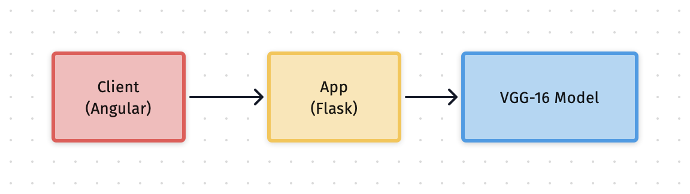
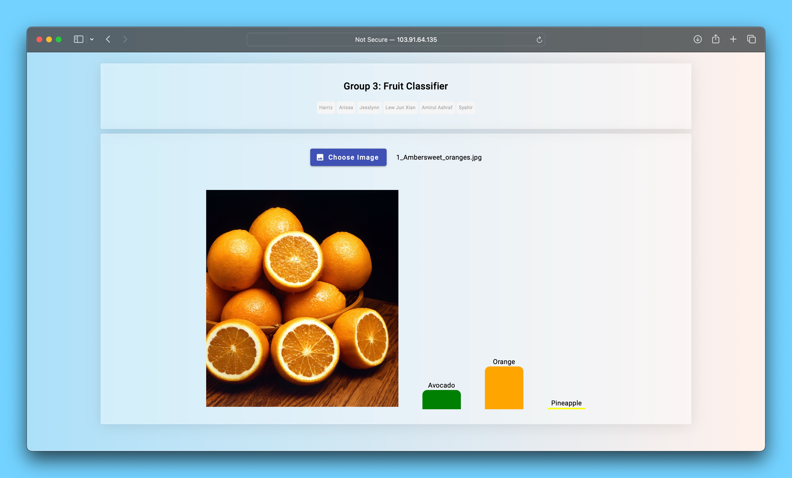
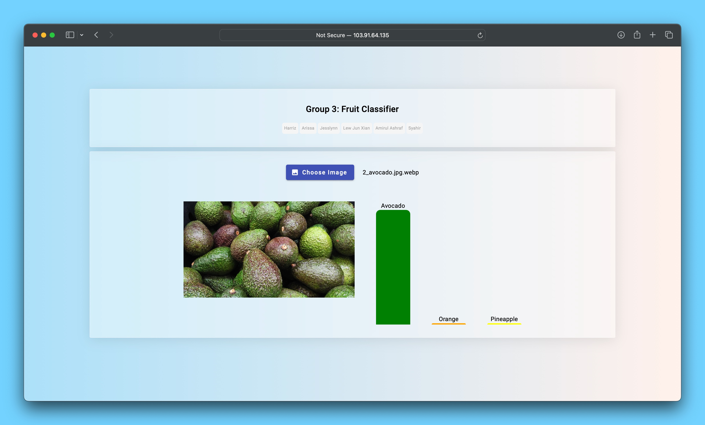
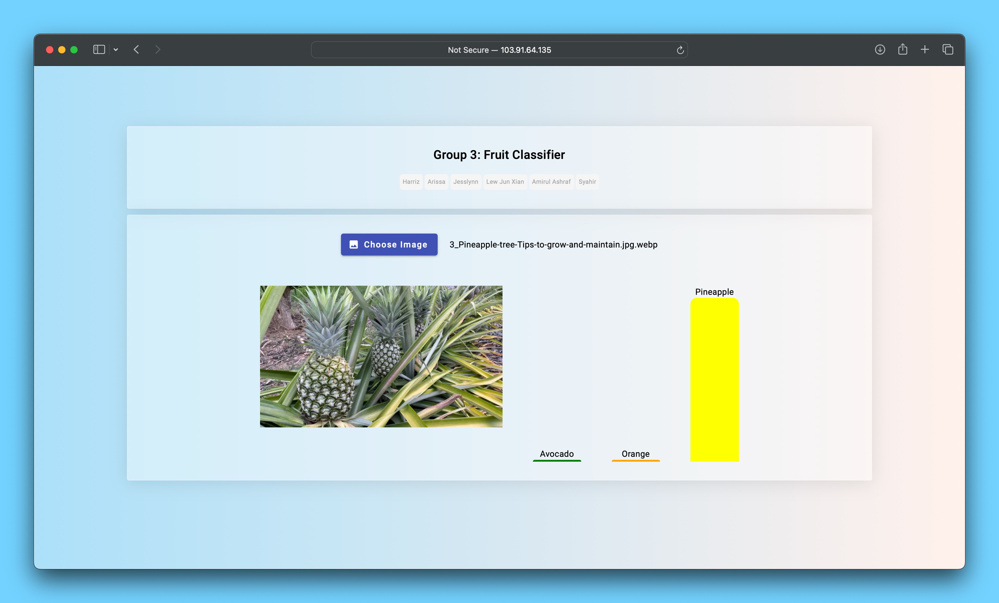

WQF7002 Group 3 Project: Fruit Classification 


Architecture Diagram 




API for Fruit Classification 

[POST] http://103.91.64.135:5000/api/predict

```json
{
    "predictions": [
        [
            -170.1094512939453,
            -235.33981323242188,
            270.53350830078125
        ]
    ],
    "result": "success"
}
```

Application Screenshot 

#1 Orange  



#2 Avocado  



#3 Pineapple 



